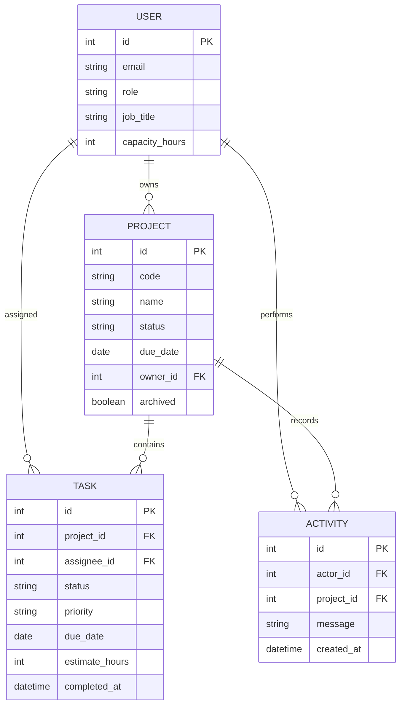

# Delivery data model

OpsBoard keeps the operational model deliberately small: people own projects and tasks, tasks determine project progress, and activity records explain how the workspace changed.

## Relationships

## People and capacity

The application user extends Django's user model with a workspace role, job title, weekly capacity and display color. Capacity is constrained to 1–80 hours and is used only for workload planning.

Open workload is the sum of unfinished task estimates assigned to a person. Utilization compares that total with weekly capacity. It is not a timesheet and does not claim that all open work is scheduled for the current week.

## Projects

A project has a unique short code, owner, client/context, target date, status and archive state. Project statuses are:

- `planning`
- `active`
- `at_risk`
- `completed`

Progress is derived from the proportion of project tasks currently in `done`; no separate progress percentage is persisted.

Archiving preserves the project and its task history. Tasks belonging to an archived project become read-only until the project is restored.

## Tasks

Tasks belong to one project and may have one assignee. They carry an estimate, deadline, priority, tags and delivery status.

Statuses are `backlog`, `in_progress`, `in_review` and `done`. Priorities are `low`, `medium`, `high` and `urgent`.

The first transition to `done` records `completed_at`. Editing an already completed task preserves the timestamp. Reopening clears it, and completing the task again records a new completion time. This timestamp drives completion-series reporting.

Estimates are integer hours from 1–160. Tags are normalized by the API before storage.

## Activity

Activity entries retain the actor, project context, message and creation time for meaningful workspace changes. Application writes and their corresponding activity entries are committed in the same database transaction where applicable, so a successful mutation is not separated from its recorded event.

Activity is an operational history, not an immutable compliance audit log.

## Reporting semantics

Archived projects are excluded from active delivery reporting. Overdue work is derived from unfinished tasks whose deadline has passed. Status and priority distributions describe the current database state.

The delivery series uses task completion timestamps. Workload aggregates unfinished estimated effort by assignee and compares it with each person's capacity. These metrics intentionally favor transparent operational definitions over a synthetic health score.